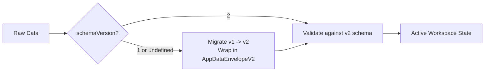
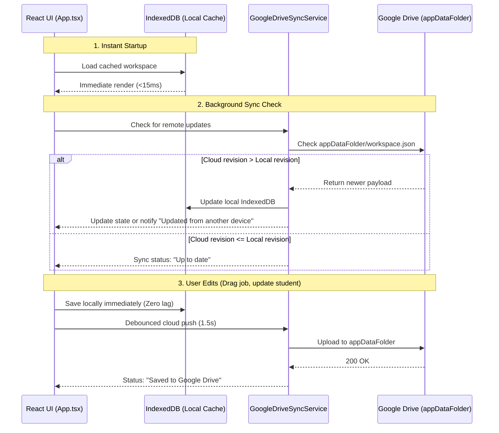

# Implementation Plan: Google Sign-In & Google Drive AppData Sync

## 1. Goal & Architecture Overview

Empower teachers to log into **Classroom Role Assigner** using their Google account to automatically synchronize classroom data across devices (school Chromebook, classroom desktop, home laptop) using their private Google Drive application folder (`appDataFolder`).

### Confirmed Decisions
- **Authentication & Backend**: 100% Google Sign-In via Google Identity Services (GIS) + Google Drive REST API (`drive.appdata`). Zero backend servers to run or maintain.
- **UI Scope**: Retain the existing **single-class UI** during this milestone; build a forward-compatible data model under the hood.
- **Local Persistence & Caching**: Upgrade from `localStorage` to `IndexedDB` with Stale-While-Revalidate (SWR) for instant, zero-latency offline use.
- **Data Protection & Compliance**: Student names, preferences, and teacher adjustments never touch external servers, remaining fully compliant with school privacy standards (FERPA).

---

## 2. Walkthrough: Setting Up Google Cloud Console & OAuth Client ID

Follow these step-by-step instructions to obtain your Google OAuth Client ID:

### Step 1: Create a Project in Google Cloud Console
1. Navigate to the [Google Cloud Console](https://console.cloud.google.com/).
2. Log in with your Google account.
3. At the top of the page, click the project selector dropdown and click **"New Project"**.
4. Project Name: `Classroom Role Assigner` (or any name you prefer).
5. Organization: Select your domain if using a school Google Workspace account, or `No organization` if using a personal Gmail account.
6. Click **Create** and select your new project once ready.

### Step 2: Enable the Google Drive API
1. In the left navigation menu, go to **APIs & Services** $\rightarrow$ **Library**.
2. Search for `Google Drive API`.
3. Click on **Google Drive API** and click **Enable**.

### Step 3: Configure the OAuth Consent Screen
1. Go to **APIs & Services** $\rightarrow$ **OAuth consent screen**.
2. Choose **User Type**:
   - If using a personal Gmail: select **External** $\rightarrow$ click **Create**.
   - If using a School Google Workspace account and only teachers in your school/district will use it: select **Internal** (this avoids any verification warnings).
3. **App Information**:
   - App name: `Classroom Role Assigner`
   - User support email: *your email*
   - Developer contact email: *your email*
   - Click **Save and Continue**.
4. **Scopes**:
   - Click **Add or Remove Scopes**.
   - Select: `.../auth/userinfo.email`, `.../auth/userinfo.profile`, `openid`.
   - In "Manually add scopes", add: `https://www.googleapis.com/auth/drive.appdata`
   - Click **Add to Table** $\rightarrow$ **Update** $\rightarrow$ **Save and Continue**.
5. **Test Users** (Critical for External mode before verification):
   - Click **+ Add Users**.
   - Add your own Google email and any test teacher emails who will be trying the app.
   - Click **Save and Continue** $\rightarrow$ **Back to Dashboard**.

### Step 4: Create OAuth 2.0 Web Client ID
1. In the left menu, go to **APIs & Services** $\rightarrow$ **Credentials**.
2. Click **+ Create Credentials** $\rightarrow$ **OAuth client ID**.
3. **Application type**: Select **Web application**.
4. **Name**: `Classroom Role Assigner Web Client`.
5. **Authorized JavaScript origins**:
   - Add: `http://localhost:5173` (for local Vite dev)
   - Add: `http://localhost:4173` (for local Vite preview)
   - Add: `https://<your-username>.github.io` (for GitHub Pages deployment)
6. Leave **Authorized redirect URIs** blank (the modern Google Identity Services token flow does not require redirect URIs).
7. Click **Create**.
8. A modal will appear showing your **Client ID** (format: `123456789012-xxxxxxxxxxxxxxxxxxxxxxxx.apps.googleusercontent.com`).
   > [!IMPORTANT]
   > Copy the **Client ID**. You do **not** need the Client Secret (in fact, client secrets must never be embedded in client-side code).

---

## 3. Data Architecture & Schema Evolution

### Data Envelope (`schemaVersion: 2`)
We will wrap the class state in an extensible envelope. This allows us to keep the current single-class UI while ensuring future-proofing for settings and multi-class archives:

```typescript
export interface AppDataEnvelopeV2 {
  schemaVersion: 2;
  lastModified: string; // ISO 8601 UTC timestamp
  revision: number; // Monotonically increasing revision counter
  data: {
    classTitle: string;
    roles: Role[];
    students: Student[];
    assignments: Assignment[];
    rotationHistory?: RotationSnapshot[];
    antiRepetitionConfig?: AntiRepetitionConfig;
  };
}
```

### Schema Migration Engine
A pure migration pipeline that safely parses any data source (legacy `localStorage`, imported JSON, or Google Drive):


- **Rollback Snapshot**: Before executing any in-place migration, the un-migrated input is automatically saved in an IndexedDB `backups` store.

---

## 4. Storage & Synchronization Flow



### Key Technical Pillars:
1. **IndexedDB Local Cache**: Uses `idb` (1KB promise wrapper). Eliminates `localStorage` 5MB limit and synchronous browser locking.
2. **Google Identity Services (GIS)**: Dynamically loads `https://accounts.google.com/gsi/client`, uses `google.accounts.oauth2.initTokenClient` with `drive.appdata` scope.
3. **Silent Token Refresh**: Tokens expire in 1 hour; GIS silently renews the token in the background as long as the user remains logged into Google in the browser.
4. **Offline Capability**: When offline (`navigator.onLine === false`), the UI saves locally, shows an "Offline (Saved locally)" badge, and automatically flushes to Google Drive when the connection returns.

---

## 5. Proposed Code Changes

### Phase 1: Storage Layer & Migration Engine
#### [NEW] [src/services/storage/indexedDb.ts](file:///Users/kai/code/school/assigner/src/services/storage/indexedDb.ts)
- `getWorkspace()`, `saveWorkspace()`, `createBackup()`.
- Automatically imports legacy data from `localStorage['classroom_role_assigner_data_v1']` on first load.

#### [NEW] [src/services/migration/migrationEngine.ts](file:///Users/kai/code/school/assigner/src/services/migration/migrationEngine.ts)
- Migration functions: `migrateV1ToV2`, validation guards.

#### [NEW] [src/services/migration/migrationEngine.test.ts](file:///Users/kai/code/school/assigner/src/services/migration/migrationEngine.test.ts)
- Unit tests verifying migration from empty, legacy, and existing states.

---

### Phase 2: Google Identity & Drive Sync Engine
#### [NEW] [src/services/auth/googleAuth.ts](file:///Users/kai/code/school/assigner/src/services/auth/googleAuth.ts)
- Initializes Google Identity Services script.
- Handles `signIn()`, `signOut()`, `getAccessToken()`, and profile information (name, email, avatar).
- Configured via `VITE_GOOGLE_CLIENT_ID` environment variable.

#### [NEW] [src/services/sync/googleDriveSync.ts](file:///Users/kai/code/school/assigner/src/services/sync/googleDriveSync.ts)
- Interacts with Google Drive API v3 `appDataFolder`.
- Methods: `fetchCloudWorkspace()`, `saveCloudWorkspace()`, `checkCloudRevision()`.

---

### Phase 3: User Interface & Integration
#### [NEW] [src/components/AccountModal.tsx](file:///Users/kai/code/school/assigner/src/components/AccountModal.tsx)
- Clean, teacher-friendly modal:
  - If signed out: "Sign in with Google" button with reassuring note about privacy and Google Drive sync.
  - If signed in: Teacher's name, email, profile photo, last synced timestamp, "Sync Now" button, and "Sign Out".

#### [MODIFY] [src/components/Navbar.tsx](file:///Users/kai/code/school/assigner/src/components/Navbar.tsx)
- Add user avatar / "Sign In" button in the top right.
- Add live sync status pill:
  - 🟢 "Synced with Google Drive"
  - 🟡 "Syncing..."
  - ⚪ "Saved to this device"
  - 🔴 "Offline (Saved locally)"

#### [MODIFY] [src/App.tsx](file:///Users/kai/code/school/assigner/src/App.tsx)
- Connect state loading to `IndexedDB`.
- Trigger debounced background sync to Google Drive when signed in.
- Preserve existing share link (`#data=...`) and JSON export/import workflows.

---

## 6. Verification Plan

### Automated Tests
```bash
npm test
```
- Verify migration engine test suite passes (`migrationEngine.test.ts`).
- Verify matching algorithm and integration tests pass without regression (`matcher.test.ts`, `App.test.tsx`).

### Manual Testing Steps
1. **Local Storage $\rightarrow$ IndexedDB Migration**:
   - Confirm current local storage data automatically loads into the app without data loss.
2. **Sign-In Flow**:
   - Click "Sign in with Google", grant permissions for test account.
   - Verify user avatar and name appear in Navbar.
3. **Google Drive Sync Verification**:
   - Edit student or role assignments.
   - Check Google Drive `appDataFolder` network request (`200 OK`).
   - Open a secondary browser or incognito window, sign in to the same Google account, and verify the data syncs across.
4. **Offline Resilience**:
   - Turn off Wi-Fi or toggle Chrome DevTools Network to "Offline".
   - Make edits $\rightarrow$ verify badge shows "Offline (Saved locally)".
   - Re-enable Wi-Fi $\rightarrow$ verify badge switches to "Syncing..." and then "Synced with Google Drive".
5. **Backwards Compatibility**:
   - Test "Export Class File (.json)" and verify file format.
   - Test shareable URL generation (`#data=...`) to confirm cross-device sharing without accounts still functions.
