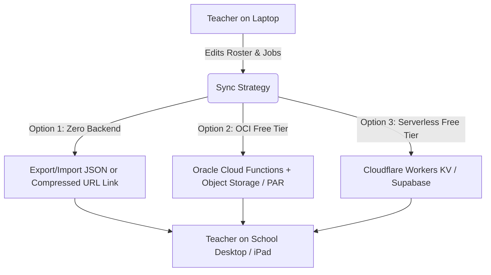

# GitHub Pages Deployment & Multi-Device Sync Plan

A technical guide and architectural comparison for deploying the Classroom Job Assigner as a static web application on GitHub Pages, along with multi-device data synchronization strategies for teachers.

---

## 1. GitHub Pages Fundamentals & Vite Setup

Because GitHub Pages is a **static web host**, it serves only static assets (`index.html`, JavaScript, CSS, images). It cannot run the local Express server (`server/index.ts`) or write directly to server disk files (`./data/*.json`).

However, because the matching engine (`src/engine/matcher.ts`) is written in pure TypeScript, **the entire optimization algorithm already runs 100% in the teacher's browser with zero backend compute required**.

### Required Frontend Changes for GitHub Pages:
1. **Vite Base Path (`vite.config.ts`)**:
   ```ts
   export default defineConfig({
     base: '/repository-name/', // or './' for relative asset paths
     plugins: [react()],
   });
   ```
2. **Automated Deployment via GitHub Actions (`.github/workflows/deploy.yml`)**:
   - Automatically builds `dist/` and deploys to the `gh-pages` branch on every push to `main`.

---

## 2. Multi-Device Sync Architecture Comparison

When a teacher works on a school desktop, an iPad, and a home laptop, we need a way to synchronize class jobs, student preferences, and assignments.



---

### Option 1: Client-Side LocalStorage + 1-Click Sync Tools (Zero Backend, 100% Free)

This is the simplest, most resilient approach. The app runs completely independently in each browser with `localStorage` and provides built-in sync tools.

#### Features:
1. **1-Click Export / Import**:
   - Top-right **"Export Class File (.json)"** and **"Import Class File"** buttons.
   - Teachers save `grade4-jobs.json` to Google Drive, iCloud, or a USB drive, and load it on any other computer in 2 seconds.
2. **Compressed Shareable URL (Link Sync)**:
   - The entire class state (~30 students, preferences, assignments) is only ~4 KB of JSON.
   - Using `lz-string` URL compression, the teacher can click **"Copy Share / Sync Link"** (`https://user.github.io/assigner/#data=eNp1k...`).
   - Opening that link on any device instantly loads the exact class state and saves it to local storage.

#### Pros & Cons:
- **Pros**: Zero backend to maintain, zero cloud accounts, zero security/privacy risks (FERPA compliant because student data never leaves the browser), never goes down.
- **Cons**: Requires manual file import or pasting a link to transfer data between computers.

---

### Option 2: Oracle Cloud Infrastructure (OCI Always Free)

Oracle Cloud provides a very generous **Always Free Tier**:
- **OCI Object Storage**: 20 GB free storage.
- **OCI Functions / API Gateway**: 2 million invocations per month free.
- **OCI Compute**: Always-Free ARM / AMD virtual machines (up to 4 OCPUs, 24 GB RAM).

#### How to Architect with OCI:
1. **Approach A: Pre-Authenticated Requests (PAR) - Zero Code Backend**:
   - Create an OCI Object Storage bucket: `classroom-assigner`.
   - Store `class-data.json` in the bucket.
   - Create a **Pre-Authenticated Request (PAR)** URL with Read/Write access (e.g. `https://objectstorage.us-ashburn-1.oraclecloud.com/p/.../o/class-data.json`).
   - In the frontend settings modal, the teacher pastes their private PAR URL once. The browser directly sends `GET` to load and `PUT` to save!
2. **Approach B: OCI Serverless Functions + API Gateway**:
   - Deploy a lightweight Python or Node.js serverless function on OCI Functions.
   - Exposes `GET /api/data` and `POST /api/save` connected to Object Storage.

#### Pros & Cons:
- **Pros**: 100% free indefinitely; true automatic cloud synchronization.
- **Cons**: High setup friction (signing up for OCI, credit card verification for free tier, IAM policies, and compartment setup can be tedious for non-devs).

---

### Option 3: Modern Lightweight Serverless Alternatives (Cloudflare Workers / Supabase)

If true automatic cloud sync is desired without OCI's complex console:

1. **Cloudflare Workers + KV (Recommended Cloud Approach)**:
   - 100,000 free requests/day.
   - A single 25-line worker script storing JSON keys (e.g. `class_room_4b`).
   - Frontend sets a simple "Classroom Passcode" to load/save automatically.
2. **Supabase / Firebase (Free Tier)**:
   - Built-in PostgreSQL / Firestore with instant REST APIs.
   - 500 MB free (app needs ~20 KB).

---

## 3. Recommended Hybrid Implementation

We recommend implementing a **Dual Storage Engine**:

1. **Default Mode (Local + Import/Export/URL)**:
   - Works immediately out-of-the-box on GitHub Pages with zero configuration.
   - Full `localStorage` persistence, JSON Export/Import, and Shareable Compressed Link.
2. **Optional Cloud Sync Settings Modal (⚙️)**:
   - A settings tab allowing the teacher to paste either:
     - An **OCI Pre-Authenticated Request (PAR) URL** (for Oracle Cloud Object Storage), OR
     - A **Cloudflare Worker API URL**, OR
     - A **Custom Webhook / REST URL**.
   - If configured, the app auto-saves to that cloud endpoint in the background; otherwise, it operates purely locally.

---

## 4. GitHub Actions Deployment Script

Add `.github/workflows/deploy.yml` to the repository:

```yaml
name: Deploy to GitHub Pages

on:
  push:
    branches: [ main ]
  workflow_dispatch:

permissions:
  contents: read
  pages: write
  id-token: write

concurrency:
  group: "pages"
  cancel-in-progress: true

jobs:
  build-and-deploy:
    environment:
      name: github-pages
      url: ${{ steps.deployment.outputs.page_url }}
    runs-on: ubuntu-latest
    steps:
      - name: Checkout repository
        uses: actions/checkout@v4

      - name: Setup Node.js
        uses: actions/setup-node@v4
        with:
          node-version: 20
          cache: 'npm'

      - name: Install dependencies
        run: npm ci

      - name: Build static site
        run: npm run build

      - name: Setup Pages
        uses: actions/configure-pages@v4

      - name: Upload artifact
        uses: actions/upload-pages-artifact@v3
        with:
          path: './dist'

      - name: Deploy to GitHub Pages
        id: deployment
        uses: actions/deploy-pages@v4
```
