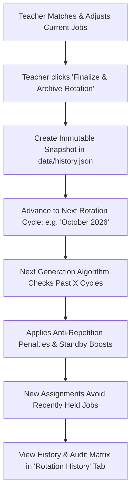

# Rotation History & Role Anti-Repetition Design Plan

A technical design document for tracking past classroom job assignments across weeks/terms to avoid repeating roles for students, prioritizing standby students, and maintaining a historical audit log for teachers.

---

## 1. Core Workflow & Lifecycle



---

## 2. Backend & Data Organization

### Storage File: `data/history.json`
Rather than storing flat lists, rotations are organized as chronologically ordered, named snapshots.

```json
[
  {
    "id": "rot-2026-09",
    "name": "September 2026 Jobs",
    "createdAt": "2026-09-01T09:00:00.000Z",
    "finalizedAt": "2026-09-28T15:30:00.000Z",
    "notes": "Fall semester start",
    "assignments": [
      { "studentId": "s-01", "roleId": "role-line-leader", "roleName": "Line Leader" },
      { "studentId": "s-02", "roleId": "role-library-helper", "roleName": "Classroom Librarian" },
      { "studentId": "s-03", "roleId": null, "roleName": null }
    ]
  },
  {
    "id": "rot-2026-10",
    "name": "October 2026 Jobs",
    "createdAt": "2026-10-01T09:00:00.000Z",
    "finalizedAt": "2026-10-31T15:00:00.000Z",
    "notes": "Second rotation",
    "assignments": [...]
  }
]
```

### Backend REST Endpoints (`server/index.ts`)
- `GET /api/history`: Returns array of past rotation snapshots.
- `POST /api/history/finalize`: Saves the current active assignments as a new snapshot in `data/history.json` and prepares the active workspace for the next term.
- `DELETE /api/history/:id`: Allows the teacher to remove or re-open an archived rotation if created by mistake.

---

## 3. Algorithmic Formulation: Anti-Repetition & Fairness

When generating assignments for a new rotation, the algorithm queries the last $X$ rotations from `data/history.json` (configurable, default $X = 2$ past cycles).

### A. Recency Decay Penalty
For each student $s$ and candidate role $r$:
- Look back over the past $X$ finalized rotations:
  - **1 cycle ago (Most Recent)**: Heavy penalty ($-80$ utility points).
  - **2 cycles ago**: Moderate penalty ($-40$ utility points).
  - **3 cycles ago**: Light penalty ($-15$ utility points).
- **Strict Ban Mode**: If a role was held in the immediately preceding cycle, set edge cost to $\infty$ (strictly forbidding repeats unless impossible to fill).

### B. Updated Edge Utility Formula
$$\text{Utility}(s, r) = \text{RankScore}(s, r) + \text{LetterBonus}(s) - \sum_{k=1}^{X} \text{RecencyPenalty}(k) \cdot \mathbb{I}[s \text{ held } r \text{ in cycle } -k]$$

### C. Standby / Reserve Fairness Priority
Students who were in the **Standby / Unassigned Pool** in the previous rotation receive a **Fairness Boost (+35 points)** on all their choices for the new rotation, guaranteeing they are prioritized for a job this cycle.

---

## 4. Snapshot & Finalization UX ("Save & Finalize Rotation")

On the **Matching Board**:
1. **"Finalize Rotation 🔒" Button**:
   - Placed in the action header next to "Generate Optimal Matches".
   - Opens a modal with a name field (defaulting to the current month, e.g., *"October 2026 Jobs"*).
2. **Options**:
   - *"Archive current assignments and clear board for next month"* OR
   - *"Archive snapshot and keep current board as draft"*.
3. Once archived, this rotation is permanently stored in `data/history.json` and used to power the anti-repetition engine.

---

## 5. UI Design: How to Display Past Assignments

### A. New Navigation Tab: "📜 Rotations & History"
- **Timeline Cards**: A list of past monthly cards (September 2026, October 2026, etc.) with satisfaction stats and the list of student assignments.
- **Class Job Matrix (Audit Table)**:
  - A grid table where **Rows = Students** and **Columns = Months/Rotations**.
  - Shows every job each student has held across the school year at a glance (e.g., *"Maya: Sept: Line Leader, Oct: Librarian, Nov: Tech Helper"*).
  - Highlights students who were on standby in past months.

### B. Contextual History Badges on Matching Board & Roster
- **On Student Cards during Drag & Drop**:
  - Tooltip: *"Previously held: Line Leader (Sept), Door Holder (Oct)"*.
  - If a student is placed into a role they held last month, a warning badge appears: `⚠️ Repeated Job (Held in Oct)`.
- **In Student Manager**:
  - A "Job History" column showing pills for all previously completed jobs.

---

## 6. Configurable Anti-Repetition Settings Modal

A settings modal (accessed via ⚙️ on the Matching Board) with simple controls:
1. **Recency Window ($X$)**: Avoid jobs held within the past `[ 1 | 2 | 3 | All ]` rotations (default: 2).
2. **Avoidance Strictness**:
   - `Strict`: Never give a student the same role if they had it within $X$ rotations.
   - `Balanced (Recommended)`: Strong penalty, but allows it if no other preferred roles are available.
3. **Standby Priority**: `On (Recommended)` — prioritize students who were unassigned in the last rotation.
